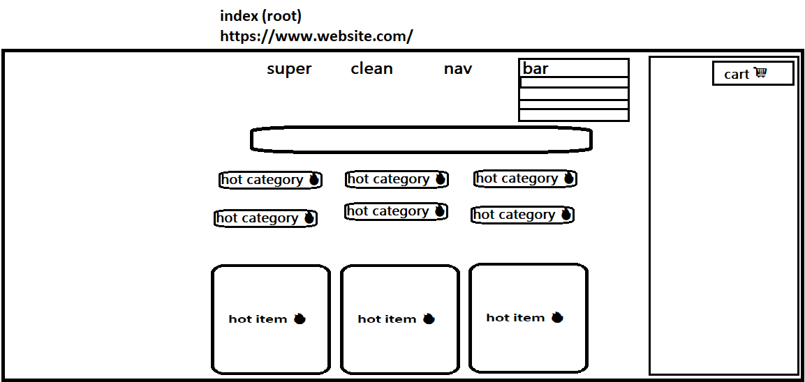

<!-- 
If you right click the readme in the file list and
click open preview, you can see how this will look. 

you will need this extension from microsoft.
for a proper preview
https://marketplace.visualstudio.com/items?itemName=ms-vscode.live-server
-->

# mp2-ecommerce
Collaborators: \
[Mohammad Zuiter](https://github.com/moefingers) \
[Diego Puente](https://github.com/dpuentex) \
[Harrison Pursley](https://github.com/HarrisonPursley)\
[Jeffery Grigsby](https://github.com/JefferyG00) \
A beautiful ecommerce website with basic functionality.

<!-- design -->
## Prototypes

## Dev Notes
- config folder containing sequelize config has not been inccluded in git ignore purposely for now.
## Ultra priority:
- Cart model
- Hosting
- cart controller
- better search api

### [Models](https://docs.google.com/spreadsheets/d/1QfpH7j5gNQoXloyshFjNvAq97LzJzVPM_XfwJFtSe18/edit#gid=0) for SQL database
- spreadsheet
- migrations
- models

## High priority:
- Jeffery, Diego please on hover I want cart panel to appear, and when clicked, there is navigation to the cart page itself
### All Pages
- nav bar 

### home page

- search component (with submit) 
- hot items component 

### store page
- adding stuff to cart 
- avg rate for each item 
- image for item 

### cart page
- display items in cart

### item page
- ratings 
- avg ratings 
- image collection 

## Low priority: 

#### nav bar
- make animation for navbar
- Make favicon.ico
- optional navbar items 

